

  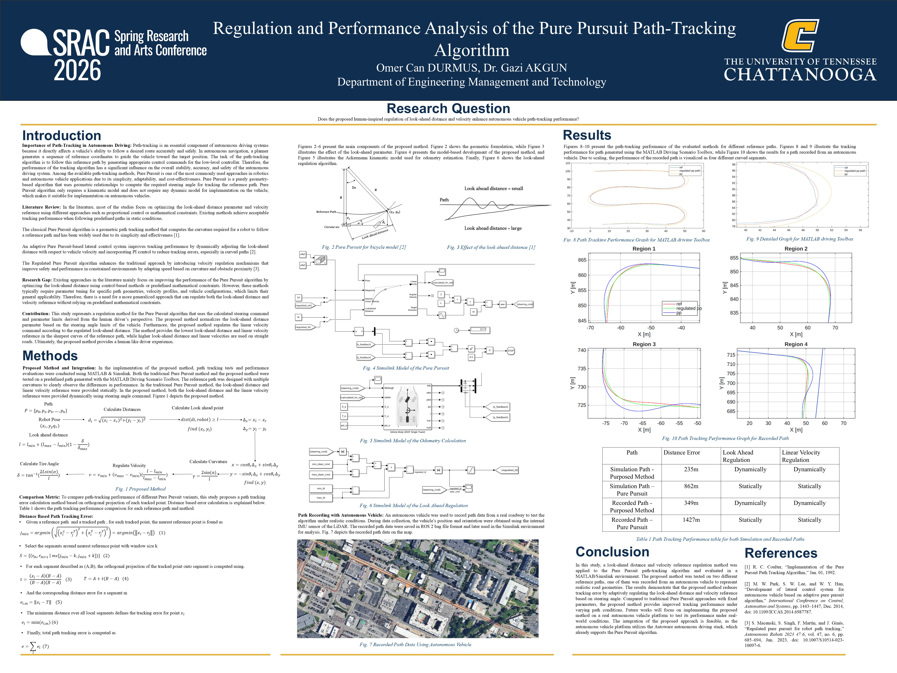

# Regulation and Performance Analysis of the Pure Pursuit Path-Tracking Algorithm

Omer Can DURMUS, Dr. Gazi AKGUN  
Department of Engineering Management and Technology  
<b>Spring Research and Arts Conference (SRAC) 2026</b>  
<b>The University of Tennessee at Chattanooga (UTC)</b>

---

## Research Question

Does the proposed human-inspired regulation of look-ahead distance and velocity enhance autonomous vehicle path-tracking performance?

---

## Introduction

### Importance of Path-Tracking in Autonomous Driving

Path-tracking is an essential component of autonomous driving systems because it directly affects a vehicle’s ability to follow a desired route accurately and safely. In autonomous navigation, a planner generates a sequence of reference coordinates to guide the vehicle toward the target position. The task of the path-tracking algorithm is to follow this reference path by generating appropriate control commands for the low-level controller. Therefore, the performance of the tracking algorithm has a significant influence on the overall stability, accuracy, and safety of the autonomous driving system. Among the available path-tracking methods, Pure Pursuit is one of the most commonly used approaches in robotics and autonomous vehicle applications due to its simplicity, adaptability, and cost-effectiveness. Pure Pursuit is a purely geometry-based algorithm that uses geometric relationships to compute the required steering angle for tracking the reference path. Pure Pursuit algorithm only requires a kinematic model and does not require any dynamic model for implementation on the vehicle, which makes it suitable for implementation on autonomous vehicles.

---

### Literature Review

In the literature, most of the studies focus on optimizing the look-ahead distance parameter and velocity reference using different approaches such as proportional control or mathematical constraints. Existing methods achieve acceptable tracking performance when following predefined paths in static conditions.

The classical Pure Pursuit algorithm is a geometric path tracking method that computes the curvature required for a robot to follow a reference path and has been widely used due to its simplicity and effectiveness [1].

An adaptive Pure Pursuit-based lateral control system improves tracking performance by dynamically adjusting the look-ahead distance with respect to vehicle velocity and incorporating PI control to reduce tracking errors, especially in curved paths [2].

The Regulated Pure Pursuit algorithm enhances the traditional approach by introducing velocity regulation mechanisms that improve safety and performance in constrained environments by adapting speed based on curvature and obstacle proximity [3].

---

### Research Gap

Existing approaches in the literature mainly focus on improving the performance of the Pure Pursuit algorithm by optimizing the look-ahead distance using control-based methods or predefined mathematical constraints. However, these methods typically require parameter tuning for specific path geometries, velocity profiles, and vehicle configurations, which limits their general applicability. Therefore, there is a need for a more generalized approach that can regulate both the look-ahead distance and velocity reference without relying on predefined mathematical constraints.

---

### Contribution

This study represents a regulation method for the Pure Pursuit algorithm that uses the calculated steering command and parameter limits derived from the human driver’s perspective. The proposed method normalizes the look-ahead distance parameter based on the steering angle limits of the vehicle. Furthermore, the proposed method regulates the linear velocity command according to the regulated look-ahead distance. The method provides the lowest look-ahead distance and linear velocity reference in the sharpest curves of the reference path, while higher look-ahead distance and linear velocities are used on straight roads. Ultimately, the proposed method provides a human like driver experience.

---

## Methods

### Proposed Method and Integration

In the implementation of the proposed method, path tracking tests and performance evaluations were conducted using MATLAB & Simulink. Both the traditional Pure Pursuit method and the proposed method were tested on a predefined path generated with the MATLAB Driving Scenario Toolbox. The reference path was designed with multiple curvatures to clearly observe the differences in performance. In the traditional Pure Pursuit method, the look-ahead distance and linear velocity reference were provided statically. In the proposed method, both the look-ahead distance and the linear velocity reference were provided dynamically using steering angle command.

---

  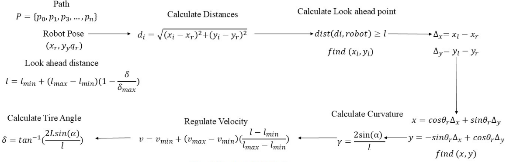

<b>Fig. 1 Proposed Method</b>

---

  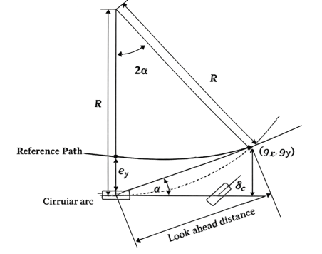

<b>Fig. 2 Pure Pursuit for bicycle model [2]</b>

---

  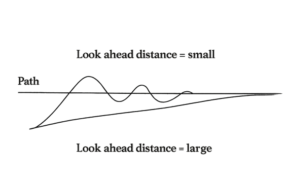

<b>Fig. 3 Effect of the look ahead distance [1]</b>

---

  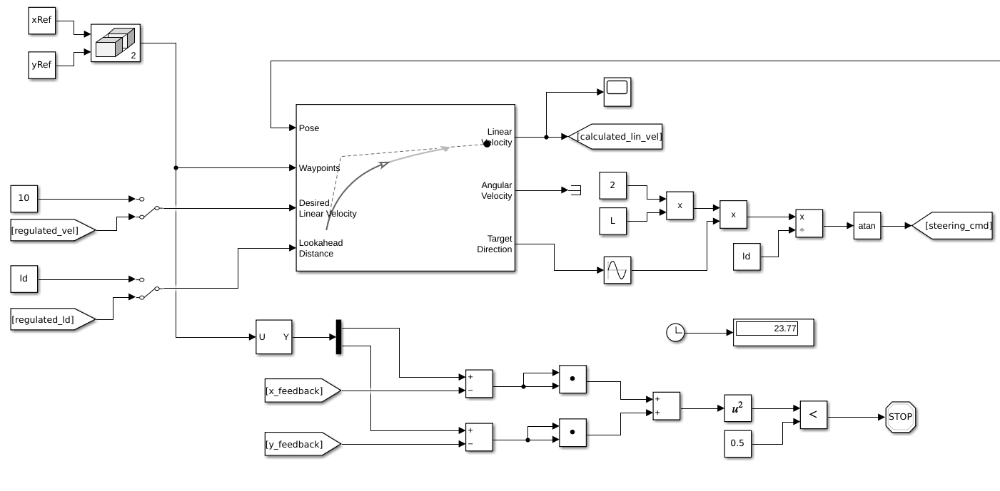

<b>Fig. 4 Simulink Model of the Pure Pursuit</b>

---

  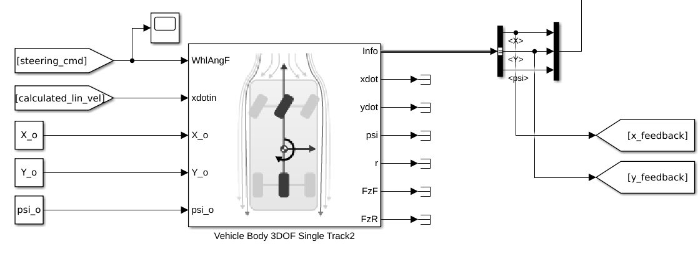

<b>Fig. 5 Simulink Model of the Odometry Calculation</b>

---

  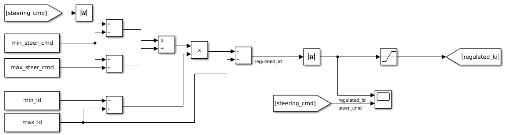

<b>Fig. 6 Simulink Model of the Look Ahead Regulation</b>

---

### Path Recording with Autonomous Vehicle

An autonomous vehicle was used to record path data from a real roadway to test the algorithm under realistic conditions. During data collection, the vehicle’s position and orientation were obtained using the internal IMU sensor of the LiDAR. The recorded path data were saved in ROS 2 bag file format and later used in the Simulink environment for analysis.

  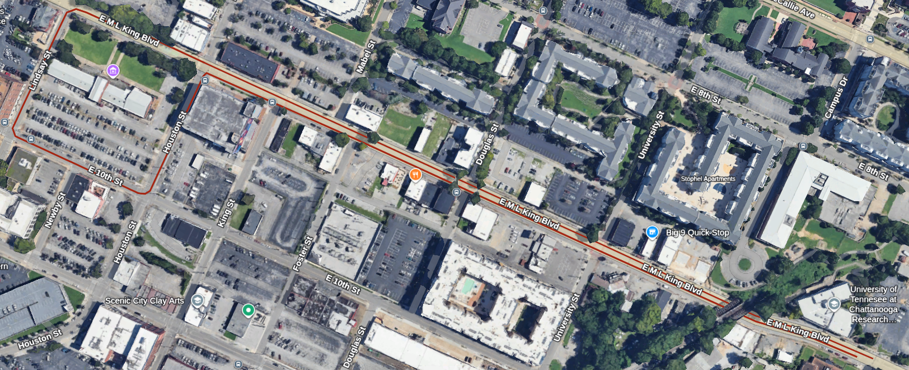

<b>Fig. 7 Recorded Path Data Using Autonomous Vehicle</b>

---

## Comparison Metric

### Distance Based Path Tracking Error

$$
j_{min} = \arg\min_j \sqrt{(x_i^x - r_j^x)^2 + (x_i^y - r_j^y)^2}
$$

$$
S = \{ r_m, r_{m+1} \mid m \in [j_{min}-k, j_{min}+k] \}
$$

$$
t = \frac{(x_i - A) \cdot (B - A)}{(B - A) \cdot (B - A)}
$$

$$
T = A + t(B - A)
$$

$$
e_{i,m} = \|x_i - T\|
$$

$$
e_i = \min(e_{i,m})
$$

$$
e = \sum_i e_i
$$

---

## Results

  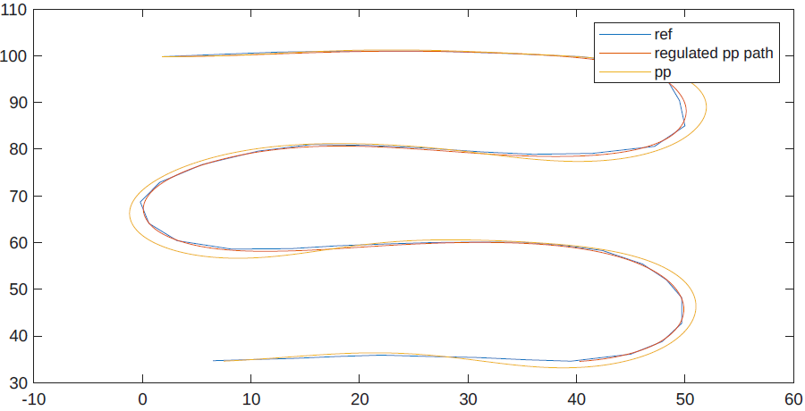

<b>Fig. 8 Path Tracking Performance Graph for MATLAB driving Toolbox</b>

---

  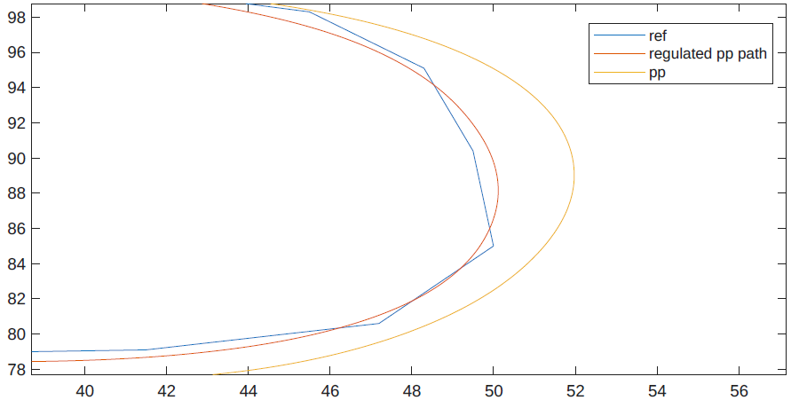

<b>Fig. 9 Detailed Graph for MATLAB driving Toolbox</b>

---

  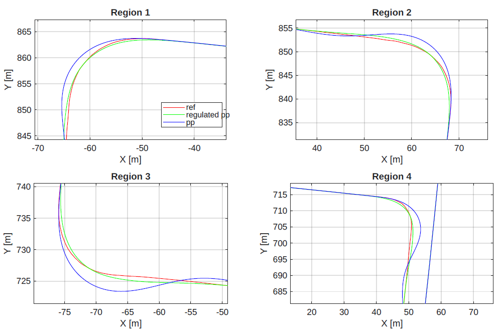

<b>Fig. 10 Path Tracking Performance Graph for Recorded Path</b>

---

### Performance Table

| Path | Distance Error | Look Ahead Regulation | Linear Velocity Regulation |
|------|--------------|----------------------|---------------------------|
| Simulation Path - Proposed Method | 235 m | Dynamically | Dynamically |
| Simulation Path – Pure Pursuit | 862 m | Statically | Statically |
| Recorded Path - Proposed Method | 349 m | Dynamically | Dynamically |
| Recorded Path – Pure Pursuit | 1427 m | Statically | Statically |

---

## Conclusion

In this study, a look-ahead distance and velocity reference regulation method was applied to the Pure Pursuit path-tracking algorithm and evaluated in a MATLAB/Simulink environment. The proposed method was tested on two different reference paths, one of them was recorded from an autonomous vehicle to represent realistic road geometries. The results demonstrate that the proposed method reduces tracking error by adaptively regulating the look-ahead distance and velocity reference based on steering angle. Compared to traditional Pure Pursuit approaches with fixed parameters, the proposed method provides improved tracking performance under varying path conditions. Future works will focus on implementing the proposed method on a real autonomous vehicle platform to test its performance under real-world conditions. The integration of the proposed approach is feasible, as the autonomous vehicle platform utilizes the Autoware autonomous driving stack, which already supports the Pure Pursuit algorithm.

---

## References

[1] R. C. Coulter, “Implementation of the Pure Pursuit Path Tracking Algorithm,” Jan. 01, 1992.  

[2] M. W. Park, S. W. Lee, and W. Y. Han, “Development of lateral control system for autonomous vehicle based on adaptive pure pursuit algorithm,” ICCAS, 2014.  

[3] S. Macenski, S. Singh, F. Martín, and J. Ginés, “Regulated pure pursuit for robot path tracking,” Autonomous Robots, 2023.  
